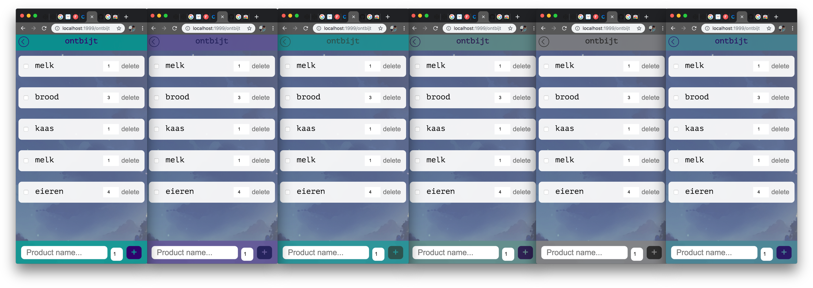
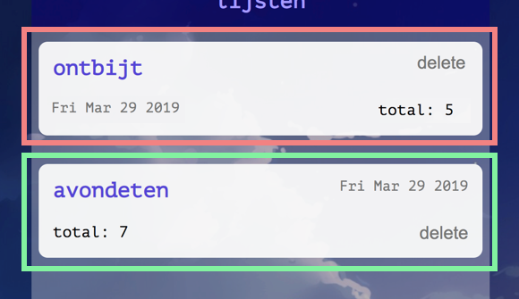

# Grocery list application

## Summary

Grocery list application, focused on accessibility and progressive enhancement.

### Use case
`"I'm going grocery shopping and I don't want to forget something. I want to add thing along the way and cross things off when I'm done."`


## Table of contents

* [Live demo](#Live-demo)
* [Install](#Install)
* [Concept](#Concept)
  * [Wireflow](#Wireflow)
* [Functionalities](#Functionalities)
* [Core functionalities](#Core-functionalities)
* [Progressive enhancement](#Progressive-enhancement)
  * [Three layers](#Three-layers)
* [Feature detection](#Feature-detection)
* [Accessibility](#Accessibility)
* [Device lab](#Device-lab)
  * [Screenreader](#Screenreader)
* [To do](#To-do)
* [Resources](#Resources)

## Live demo
Click [here](https://maybuzz-bt.herokuapp.com/) to see my live demo!

## Install
To install this project you'll have to fork this repository and open your terminal

```bash
  # insert your username to this link
  # put this in your terminal to clone the repo
  git clone https://github.com/YOUR-USER-NAME/browser-technologies-1819.git

  # use the "dev" script from package.json to start the server
  npm run dev
```

## Concept
I am building an application that will serve as a grocery/todo list. Users can create multiple lists and add items to those lists. Items can be checked off and deleted. Users can also add a quantity to the item.

Checked item will be crossed through, but not deleted. This way lists and items can easily be reused. Ideally checked items would and finished lists would be placed at the bottom of the list. But I didn't build that feature yet.

### Wireflow


## Core functionalities
The core functionalities of this application are:
1. Create lists

2. Add items to lists
3. Check items off list

4. Remove items from list
6. Edit items

5. Save progress

I managed to workout most of these functionalities. Number `6. Edit items` didn't make it through -yet-. The progress feedback to the user isn't worked out yet. At least nog client side. The server shows the total amount of items in the list.

## Functionalities
* [x] Add lists
* [x] Delete lists
* [x] Add products
* [x] Add amount of products
* [x] Delete products
* [x] Edit amount
* [x] Save stuff in database, **server**
* [x] Save stuff in localStorage, **client**
* [ ] Edit list- and product names
* [ ] Side menu
* [ ] Progress feedback


## Progressive enhancement
This app is progressive enhanced by localStorage. When javascript is enabled, `localStorage` will enable user to save checked items to the database. I wasn't able to add this functionality to my `server` in time. So I am serving this `client side`. Without javascript users will still be able to add and delete items and lists. For checking the items, javascript has to be enabled.

The total number and date stamp are `server side` enhancements. These are also good for user feedback. It tells users how many items are in the list and the date of when the list was created.

```js
// this is my localStorage function
// from main.js

function save() {

  for (i = 0; i < el.length; i++) {
    localStorage.setItem(list + "-" + el[i].value, el[i].checked);
  }

};
```

There are a few enhancements I would like to implement later:
- `server side` storing checkbox values

- `progress bar` + `progress counter`

- `inline editing` lists or items

- `warning` users before deleting items

- `side menu` -> for fast(er) navigation in case the user navigates to the wrong list
- `adding the same items to 1 list` -> checking the input before writing it to the database and warning the user

- `negative values` in product quantities
- delete items when focussing on an item and pressing enter -> pressing enter while focussing of the form will trigger the submit button. I should have disabled this but I noticed it too late.

### Three layers
#### Functional
This application is functional in many ways. Users can create different types of lists; grocery lists, to-do lists, you name it. Tasks can be added and crossed off, even deleted.

#### Usable
The json database makes it possible to add new lists and items and save them for later. With javascript on, localStorage will even save checked checkboxes. This way users can use the app for real and come back at any time to cross more things off their list. Checked items will cross through, this is good user feedback. I think it makes it feel like a real list.

#### Pleasurable
I think this app could be very pleasurable. It's very simple. Works al the time. No passwords, no logins. Just simple forms and checkboxes. Maybe with some more features, user feedback and animations it would be even better.

## Feature detection
There are a few features in this app that could use some detection. Such as localStorage. When javascript is disabled, best practice would be to inform the user of the fact that checked items will not be saved.

I used [caniuse.com](https://caniuse.com/) to check the support of several features I use. As you can see these features are supported well in almost all browsers. The least supported feature are the `CSS variables` i use to set colors. Still, I think 90% is a fair percentage.


## Accessibility
To test the app for colorblindness and contrast I used several tools. I installed a plugin in my Google Chrome browser, called [Colorblinding](https://chrome.google.com/webstore/detail/colorblinding/dgbgleaofjainknadoffbjkclicbbgaa).

These are the types of colorblind-settings offered by the plugin.


The images below are my pages, showing the different types of colorblindness. The first screen on the shows the current design. The first screens show the lists. The seconds screens show the items in the list.




## Device lab
During the device lab test on my herokuapp I came across multiple problems. Some of which are caused by the bad user experience of the different devices. I found it hard to pinpoint mistakes in my design that I could change to better the performance.

Below you can see images of my device lab test. The first mobile images are pretty good. Users can add lists and add and delete products. Styling works fine too. The first screen shows the same list multiple times, this is because it shows on multiple devices.


The following images show good and bad performance on the tablets. The first tablet works great. Styling looks good. Functionalities work fine and it doesn't add multiple lists to the first page.

The second tablet shows a bad performance. Styling isn't working correctly. Users can not add lists, adding products also doesn't work.


### Screenreader
This app is very simple and works fine with the Voice Over on the macbook pro I tested it on. I leared a few things from this screenreader test. After doing the first test I changed the order of the items on the first page. This way the screenreader will read the items in a logical order, ending with the delete button.




Overall the apps works with tabs. All the functionalities are usable. Decent labels for links and buttons will give screen-reader-users the right information, instead of "link" or "X" or "read more".

## To-do

* [x] Device lab
* [x] Screen reader test
* [x] Flowchart
* [x] Node express server
* [x] Concrete, correct HTML
* [x] CSS styling
* [x] Color contrast check
* [x] Functional without js
* [x] Form actions
  * [x] Add
  * [x] Remove
  * [ ] Edit
* [ ] Server side enhancements
  * [x] Show total amount of items
  * [ ] Checked items counter
* [ ] Client side enhancements
  * [x] localStorage
  * [ ] Progress bar
* [ ] Extra's
  * [x] Set date
  * [x] JSON database
  * [ ] Side menu

## Resources
- [Time stamps in js](https://timestamp.online/article/how-to-convert-timestamp-to-datetime-in-javascript)
- [caniuse.com](https://caniuse.com)
- [Color contrast checker](https://color.review/)
- [Colorblinding tool](https://chrome.google.com/webstore/detail/colorblinding/dgbgleaofjainknadoffbjkclicbbgaa)
- [Slackoverflow addeventlistener question](https://stackoverflow.com/questions/42080365/using-addeventlistener-and-getelementsbyclassname-to-pass-an-element-id/42080408)

<!-- ## Criteria

<details><summary>Assignment 2</summary>
<ul>
  <li>[x] De code staat in een repository op GitHub</li>
  <li>De demo is opgebouwd in 3 lagen, volgens het principe van Progressive Enhancement</li>
  <li>Student kan de Basic functionaliteit van een use case doorgronden</li>
  <li>Student kan uitleggen wat Progressive Enhancement en Feature Detectie is en hoe dit toe te passen in Web Development</li>
</ul>

<details><summary>Readme</summary>
<ul>
  <li>[x] Een (wireflow) schets van de functionaliteit met een beschrijving van de core functionality. Geef ook aan wat de  functional, reliable, usable en pleasurable laag.</li>
  <li>[x] Een beschrijving van de feature(s)/Browser Technologies</li>
  <li>Welke browser de feature(s) wel/niet ondersteunen</li>
  <li>Een beschrijving van de accessibility issues die zijn onderzocht</li>
</ul>
</details>

<details><summary>UX demo</summary>
<ul>
  <li>[x] De leesbaarheidsregels zijn toegepast, contrast en kleuren kloppen</li>
  <li>Het heeft een gebruiksvriendelijke interface, met gebruikmaking van affordance en feedback op de interactieve elementen</li>
  <li>Met meest 'enhanced' versie is super vet, gaaf en h-e-l-e-maal te leuk om te gebruiken</li>
</ul>
</details> -->

## License

[MIT](LICENSE) © [Luna May Johansson](https://github.com/maybuzz)
